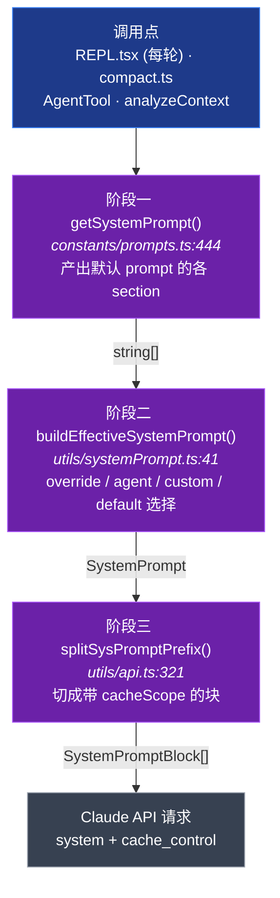
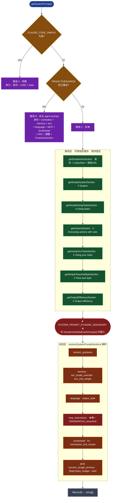
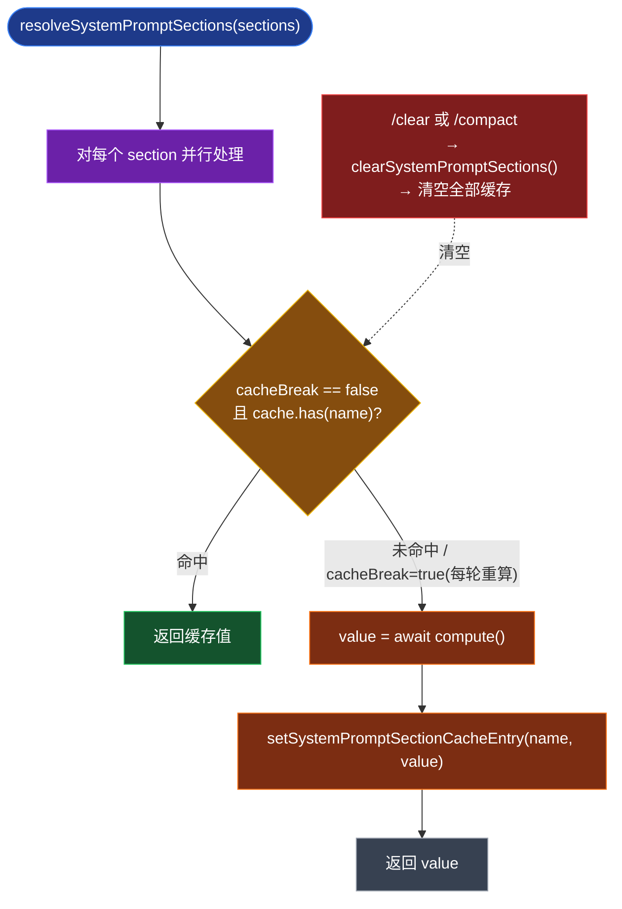
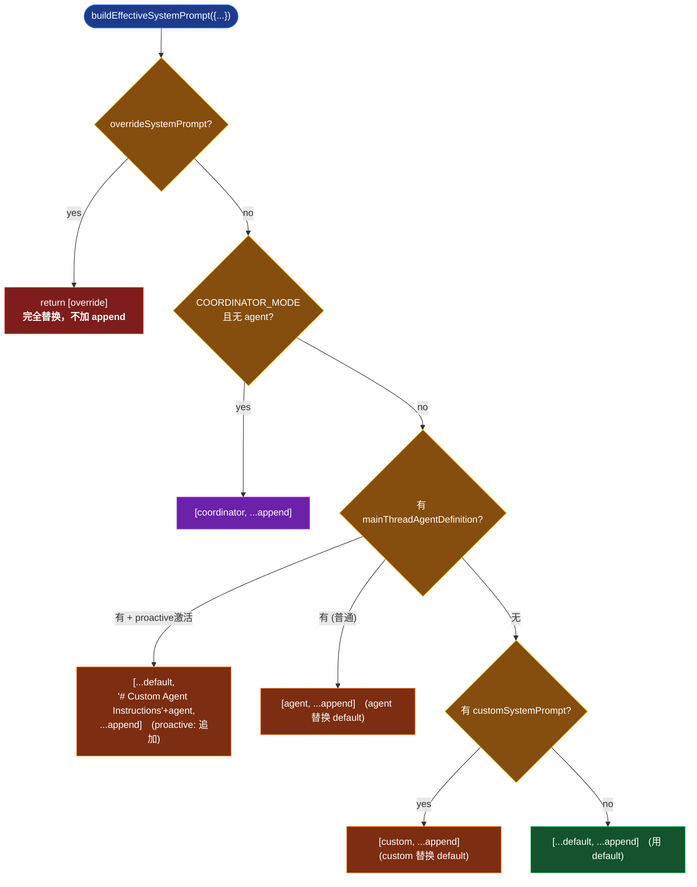
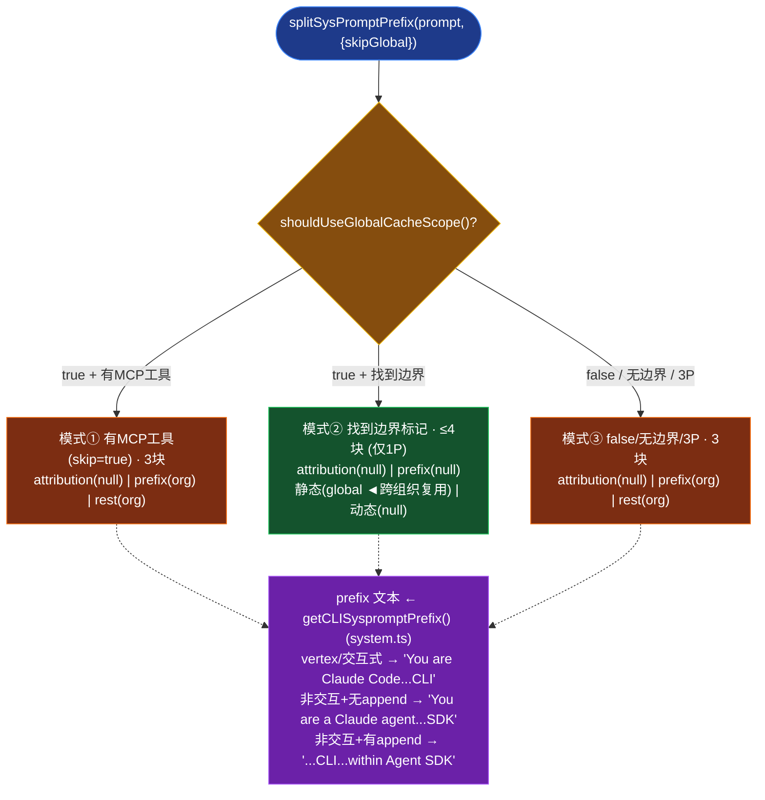
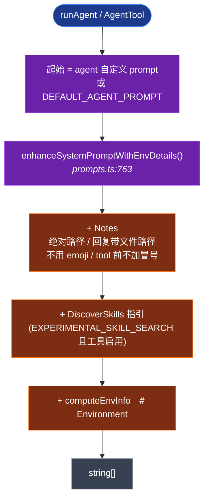

# Claude Code System Prompt 构造流程图

> 配套文字说明见对话记录 / `CLAUDE.md`。下列 Mermaid 图按 GitHub / 飞书 Mermaid 渲染器兼容写法编写。
> 颜色图例：🔵 调用点/入口　🟣 核心阶段　🟢 静态区(可缓存)　🟠 动态区　🔴 缓存边界/击穿点　🟡 分支决策

---

## 1. 总览：三阶段流水线

---

## 2. 阶段一：getSystemPrompt 内部分支

---

## 3. 动态 section 的缓存解析

---

## 4. 阶段二：优先级决策树

---

## 5. 阶段三：切缓存块（三种模式）

---

## 6. Subagent 旁路（不走 getSystemPrompt）

